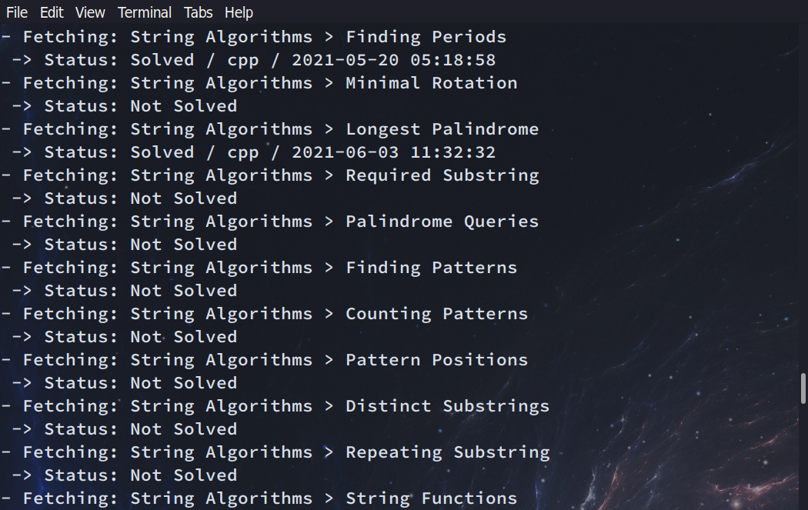
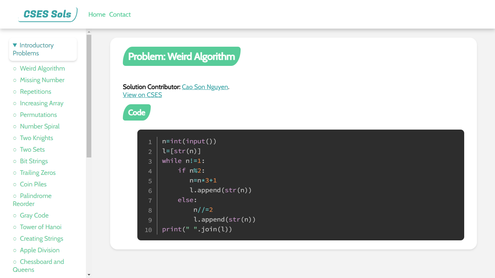

# CSES Sols
CSES problem set solutions downloader + packager with web interface provided by [Dinh Nam Nguyen](https://github.com/NguyenD-Nam).

The site provides my solutions for coding problems of CSES site that is owned by Antti Laaksonen & Topi Talvitie during our data structures and algorithms learning. Most of the solutions are written in C++ and Python programming language.

## Screenshots:
 
 

## How to download your CSES solutions and/or package them into web interface:
You actually only need crawler.py (and htmlgen.py, style.css, content.css if you want to package solutions) for this. You might want to create an empty directory and put only those files inside. Then:
    - `python crawler.py` to download all problems
    - `python crawler.py <problemID>` to download a specific problem
